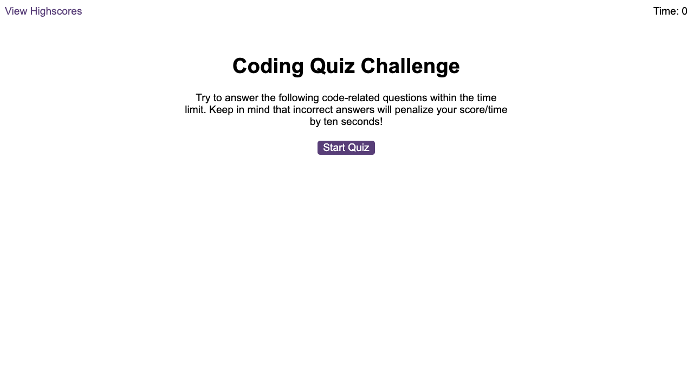
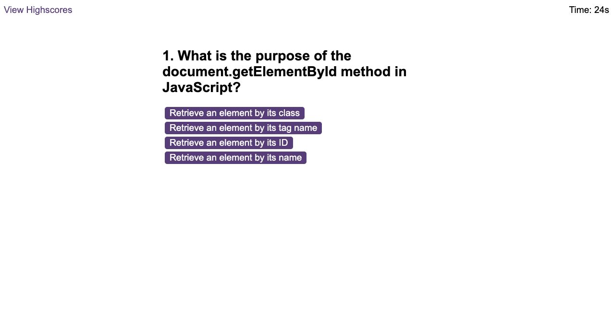
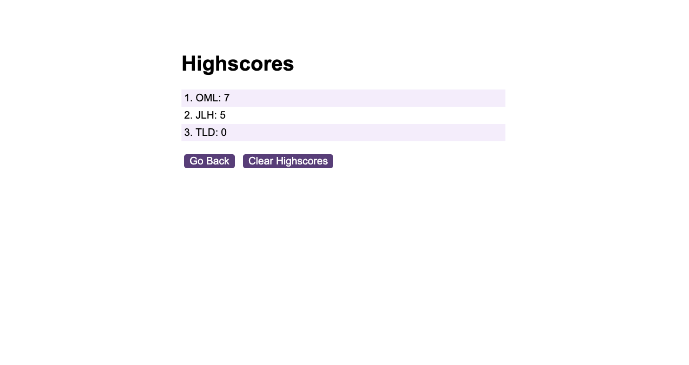

# super-awesome-quizmaster
A quizmaster game designed using Javascript fundamentals to build and store data from a quiz to test Bootcamp students' knowledge.

## Description 
The goal of this project was to deliver a quiz program that met specific criteria including use of DOM manipulation and advanced JavaScript functions. Due to the nature of this project, there was no creation of html or css elements and I did not format the html page in any way other than was provided as a starter template. 

**https://nonebula.github.io/super-awesome-quizmaster/**

## Table of Contents

* [Installation](#installation)
* [Usage](#usage)
* [Credits](#credits)
* [License](#license)

## Installation
This project is a website hosted on GitHub. To access and use the website, follow these steps:

1. **Open your web browser:** Launch your preferred web browser.
2. **Visit the project repository:** **https://github.com/nonebula/super-awesome-quizmaster**
3. **Navigate to the website:** Click the link to the website in the readme or via the repository.
4. **Explore the website:** Click 'Start Quiz' and answer the questions within the time limit to test your knowledge!

If you encounter any issues or have questions, please refer to the documentation or contact the developers.

## Usage 
The page demonstrates full functionality. Click on 'Start Quiz' to commence the quiz. Work your way through the questions but be careful not to get too many questions wrong because a wrong answer will subtract 10 seconds from the timer! Stack up on those correct answers though, because they'll add 10 seconds back to the timer, too! Once you have completed the quiz, you will be prompted to provide your initials and if you're lucky, you'll find yourself on the scoreboard. If you want to clear the scoreboard or go back to the homepage, simply click the buttons below the scoreboard and they'll do exactly what you would expect them to. Happy quizzing and good luck! 

## Credits

The project was completed independently but built off the source code from: edX Boot Camps LLC. I worked with a friend, Sam Millar, to explore the fundamentals of Javascript and clarify my work. I also worked through the modules on Codecademy to better develop my understanding to enable me to solve these challenges. In producing this webpage, I also utilized a range of tutorials from W3 Schools and referred to multiple posts on Stack Overflow. I also utilized the support of the course teaching assistants and my tutor, Juan Delgado.

## License

MIT License

Copyright (c) 2023 nonebula

Permission is hereby granted, free of charge, to any person obtaining a copy
of this software and associated documentation files (the "Software"), to deal
in the Software without restriction, including without limitation the rights
to use, copy, modify, merge, publish, distribute, sublicense, and/or sell
copies of the Software, and to permit persons to whom the Software is
furnished to do so, subject to the following conditions:

The above copyright notice and this permission notice shall be included in all
copies or substantial portions of the Software.

THE SOFTWARE IS PROVIDED "AS IS", WITHOUT WARRANTY OF ANY KIND, EXPRESS OR
IMPLIED, INCLUDING BUT NOT LIMITED TO THE WARRANTIES OF MERCHANTABILITY,
FITNESS FOR A PARTICULAR PURPOSE AND NONINFRINGEMENT. IN NO EVENT SHALL THE
AUTHORS OR COPYRIGHT HOLDERS BE LIABLE FOR ANY CLAIM, DAMAGES OR OTHER
LIABILITY, WHETHER IN AN ACTION OF CONTRACT, TORT OR OTHERWISE, ARISING FROM,
OUT OF OR IN CONNECTION WITH THE SOFTWARE OR THE USE OR OTHER DEALINGS IN THE
SOFTWARE.